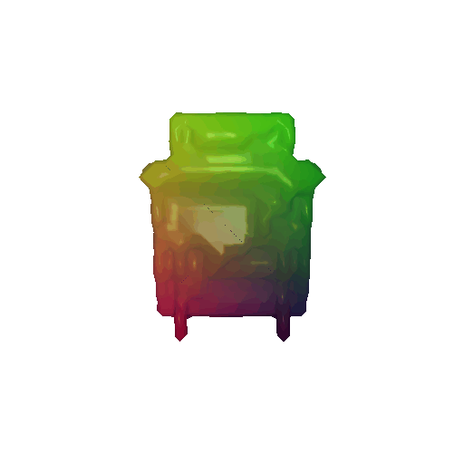
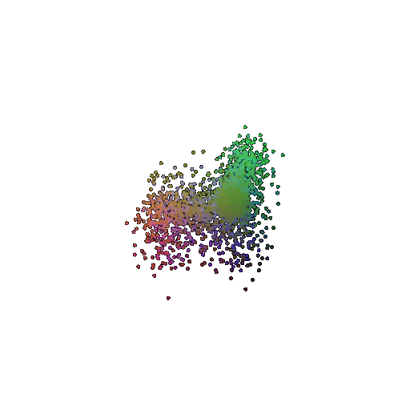
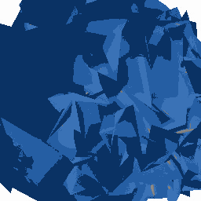

Single View to 3D
========================
**Name: Omkar Chittar**  
------------------------
```
Single_View_to_3D
+-dataset
+-output
+-README.md
+-report
+-requirements.txt
```

# **Installation**

- Download and extract the files.
- Make sure you meet all the requirements given on: https://github.com/848f-3DVision/assignment2/tree/main
- The **dataset** folder consists of all the data necessary for the code.
- Unzip the `r2n2_shapenet_dataset` folder in the **dataset** folder.
- The **output** folder has all the images/gifs generated after running the codes.
- All the necessary instructions for running the code are given in **README.md**.
- The folder **report** has the html file that leads to the webpage.


# **1. Exploring loss functions**

## **1.1 Fitting a voxel grid**
Run the code:  
   ```
 python render_voxel.py
   ``` 
The code renders the ground truth and the optimized voxel grid is saved as *gt_vox_grid.gif* and *opt_vox_grid* respectively in the output folder. 

Ground Truth Voxel Grid | Optimized Voxel Grid
------------------------|---------------------
 | 

## **1.2 Fitting a point cloud**

Run the code:  
   ```
 python render_pointcloud.py
   ```
The code renders the ground truth and the optimized voxel grid is saved as *gt_pointcloud.gif* and *opt_pointcloud* respectively in the output folder. 

Ground Truth Point Cloud | Optimized Point Cloud
-------------------------|---------------------
 | 

## **1.3 Fitting a mesh**
Run the code:  
   ```
 python render_mesh.py
   ```
The code renders the ground truth and the optimized voxel grid is saved as *gt_mesh.gif* and *opt_mesh* respectively in the output folder. 

Ground Truth Mesh | Optimized Mesh
------------------------|---------------------
 | 

# **2. Reconstructing 3D from single view**
## **2.1 Image to voxel grid**
Training:  
   ```
 python train_model.py --type 'vox'
   ```

followed by  

Evaluation:
   ```
 python eval_model.py --type 'vox' --load_checkpoint 
   ```
If the training stops abruptly due to GPU limitations, execute the command again while including the option '--load_checkpoint'.  
The renders/visualizations are saved in the output folder. 

 Input Image | Ground Truth Voxel Grid | Predicted Voxel Grid
------------|-------------------------|---------------------
 |  | 
 |  | 
 |  | 

## **2.2 Image to point cloud**
Training:  
   ```
 python train_model.py --type 'point'
   ```

followed by  

Evaluation:
   ```
 python eval_model.py --type 'point' --load_checkpoint 
   ```
If the training stops abruptly due to GPU limitations, execute the command again while including the option '--load_checkpoint'.  
The renders/visualizations are saved in the output folder. 

 Input Image | Ground Truth Point Cloud | Predicted Point Cloud
------------|-------------------------|---------------------
 |  | 
 |  | 
 |  | 

## **2.3 Image to mesh**
Training:  
   ```
 python train_model.py --type 'mesh'
   ```

followed by  

Evaluation:
   ```
 python eval_model.py --type 'mesh' --load_checkpoint 
   ```
If the training stops abruptly due to GPU limitations, execute the command again while including the option '--load_checkpoint'.  
The renders/visualizations are saved in the output folder. 

 Input Image | Ground Truth Mesh | Predicted Mesh
------------|-------------------------|---------------------
 |  | 
 |  | 
 |  | 

## **2.4 Quantitative comparisions**
Running the code, 
   ```
 python eval_model.py --type voxel|mesh|point --load_checkpoint
   ```
produces evaluation plots for the respective representations and is stored in the parent folder.

Training the Voxel Grid model proved to be more challenging due to the necessity of employing complex architectures that involve 3D convolutions instead of fully connected (FC) layers. This architectural complexity partially accounts for the lower F1 score achieved in comparison to the other two prediction methods.

On the other hand, the Point Cloud and Mesh prediction models exhibited significantly higher average F1 scores. 

The Point Cloud prediction task, in particular, is comparatively easier because it doesn't require predicting connectivity information. In contrast, Mesh prediction necessitates capturing both the geometric shape and the connectivity information, making it a more intricate task that, while challenging, is ultimately rewarding in terms of higher F1 scores.

 Voxel Grid | Point Cloud | Mesh
-----------|-------------|------
 |  |  

## **2.5 Analyse effects of hyperparms variations**
I have tried observing the effects of variation of the argument 'n_points' on the point cloud render, the values chosen being [1000, 5000, 10000] and visualized their respective eval plots.
You can repeat the process by executing the commands for pointcloud as mentioned above with the value of n_points of your choice.

| Effects of variation of the hyperparameter *n_points* on predictions:
 1000 | 5000 | 10000 
-----|------|------
 |  |   
 |  | 

From the above plots it is evident that the model is unable to learn much during training with fewer number of points.

At lower n_points, the model learns generic things and misses out on the finer details.

The F1 score increases as we increase the number of points from 1000 to 5000, after which there is a slight decline in the F1 score. 


## **2.6 Interpret your model**
To interpret what my model is learning, I tried to visualize how the mesh learns during training.

I stored images of the predicted mesh at different training steps and then combined them into a single gif.

As we see in the gif, the mesh is highly unstable in the beginning and stabilizes over time.

| Mesh Deformations Through Iterations |
|--------------------------------------|
|  |


# **3. Webpage**
The html code for the [webpage](https://github.com/omkarchittar/Single_View_to_3D/blob/main/report/webpage.md.html) is stored in the *report* folder along with the images/gifs.
Clicking on the *webpage.md.html* file will take you directly to the webpage.


